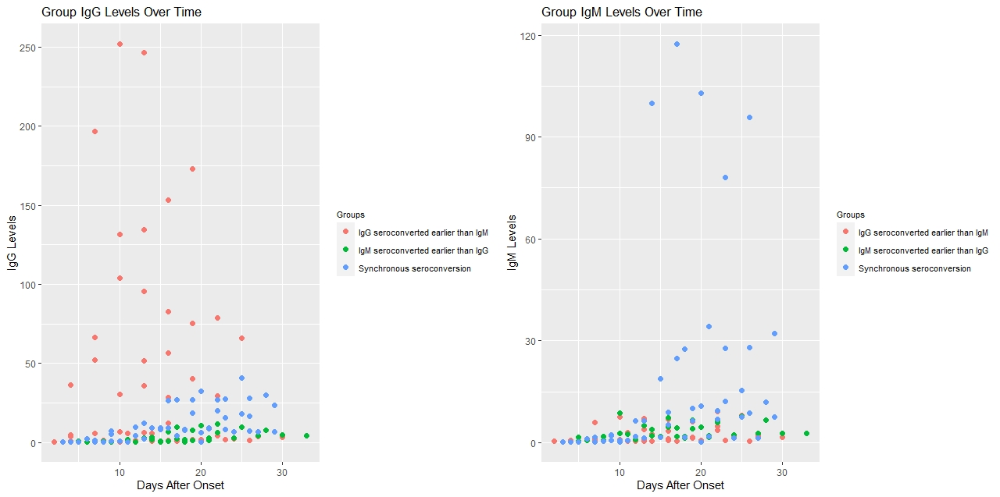
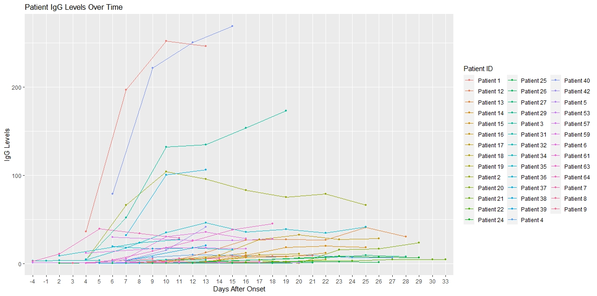

# Analyzing-Data-of-SARS-CoV-2-Serology-Antibody-IgG-Tests
Analyzing Data of SARS-CoV-2 Serology Antibody (IgG) Tests. Data visualization with R and Python. Sample: https://fredman.shinyapps.io/ddash/

As a part of the Coronavirus Visualization Team under [Harvard's Erevna Program](https://projects.iq.harvard.edu/erevna/home), 
I researched how our body's IgG and IgM antibodies are effected by SARS-CoV-2 (Covid-19). 

My job was to create visualizations, which can be found in this repository.
On the side, I also explored the [Shiny](https://www.shinyapps.io/) package and created a basic interactive visualization website
[here](https://fredman.shinyapps.io/ddash/)

